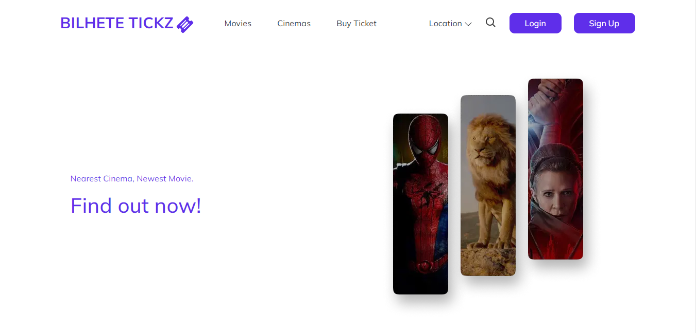
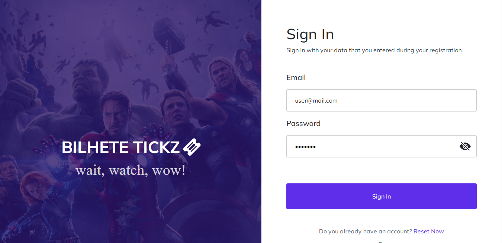
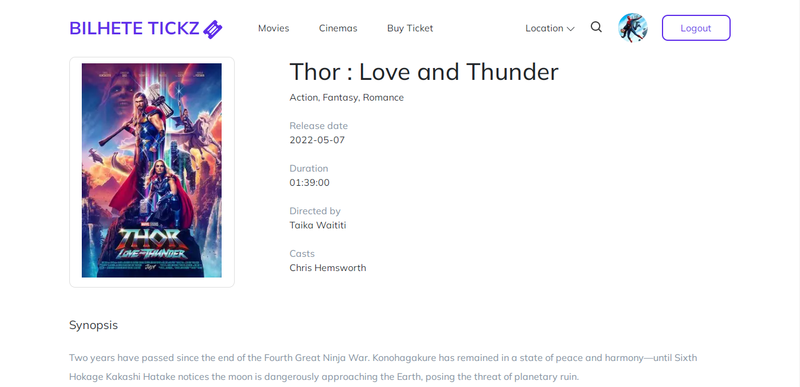

<p align="center">

  <h1 align="center">Bilhete Tickz Client</h1>

  <p align="center">
    <br />
    <a href="#">View Live Application</a>
    ·
    <a href="#">Report Bug</a>
    ·
    <a href="#">Request Feature</a>
  </p>
</p>

## Table of Contents

-  [About the Project](#about-the-project)
   -  [Built With](#built-with)
-  [Getting Started](#getting-started)
   -  [Prerequisites](#prerequisites)
   -  [Installation](#installation)
-  [Related Project](#related-project)

## About The Project

Bilhete Tickz is a web app that can help you book movie tickets

### Built With


[](https://getbootstrap.com/)
<br>

[](https://nextjs.org/)
[](https://reactjs.org/)
[](https://redux.js.org/)
[](https://vercel.com/)
<br>

## Getting Started

### Prerequisites

-  [NodeJs](https://nodejs.org/)
-  [PostgreSql](https://www.postgresql.org/)
-  [Postman](https://www.postman.com/)

### Installation

1. Clone the repo

```sh
$ git clone https://github.com/faryadicka/Bilhete-Tickz-Client
```

2. Install NPM packages

```sh
$ npm install
```

3. Add .env.local file at root folder project, and add following

```sh
NEXT_PUBLIC_BE_HOST=*YOUR BACKEND HOST*
```

4. Starting application

```sh
$ npm run dev
```

5. Bilhete Tickz Client App is Running in http://localhost:3000/

### Preview

<div style="display:flex, flex-direction: column" >





</div>

### Related Project

-  [`Frontend-Bilhete-Tickz`](https://github.com/faryadicka/Bilhete-Tickz-Client)
-  [`Backend-Bilhete-Tickz`](https://github.com/RivaldiSiby/Bilhete-Tickz)

## 🤝 Bilhete-Tickz - Team Project

|                                      [Elyas Purba Prastiya](https://github.com/elyasprba)                                       | [Yoga Arta Grahanantyo](https://github.com/yogaarta) | [Ferry Aryadicka](https://github.com/faryadicka) | [Ilham Nurrohman](https://github.com/IlhamNurrohman) | [Rivaldi Christovel Siby](https://github.com/RivaldiSiby) |
| :-----------------------------------------------------------------------------------------------------------------------------: | :--------------------------------------------------: | :----------------------------------------------: | :--------------------------------------------------: | :-------------------------------------------------------: |
|  |  |    |        |     |
|                                                 <b>PM & Frontend Developer</b>                                                  |              <b>Fullstack Developer</b>              |            <b>Frontend Developer</b>             |               <b>Backend Developer</b>               |                <b>Fullstack Developer</b>                 |
